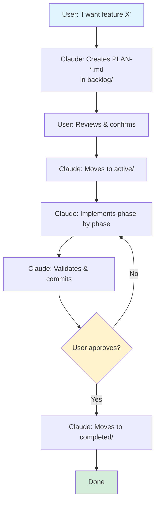

# Plan to Implementation Workflow

How plans become implemented features.

**Related:**
- [PLANS.md](PLANS.md) - Plan structure, templates, and best practices
- Git hosting guide — platform-specific PR, merge, and issue/work item commands. Use the file that matches your repo's hosting platform:
  - [GIT-HOSTING-GITHUB.md](GIT-HOSTING-GITHUB.md) — for repos on GitHub
  - [GIT-HOSTING-AZURE-DEVOPS.md](GIT-HOSTING-AZURE-DEVOPS.md) — for repos on Azure DevOps

---

## The Flow

**Note:** Claude always asks for confirmation before running git commands (add, commit, push, branch, merge).



**Text version:**

```
┌─────────────────────────────────────────────────────────────────────┐
│                                                                     │
│  1. USER: "I want to add feature X" or "Fix problem Y"              │
│                                                                     │
│  2. CLAUDE:                                                         │
│     - Creates PLAN-*.md or INVESTIGATE-*.md in backlog/             │
│     - Asks user to review the plan                                  │
│                                                                     │
│  3. USER: Reviews and edits the plan, then confirms                 │
│                                                                     │
│  4. CLAUDE:                                                         │
│     - Moves plan to active/                                         │
│     - Implements phase by phase                                     │
│     - Runs validation after each phase                              │
│     - Commits after each phase                                      │
│     - Updates plan with progress                                    │
│                                                                     │
│  5. USER: Reviews result                                            │
│                                                                     │
│  6. CLAUDE:                                                         │
│     - Moves plan to completed/                                      │
│     - Final commit                                                  │
│                                                                     │
└─────────────────────────────────────────────────────────────────────┘
```

---

## Step 1: Describe What You Want

Tell Claude what you want to do:

```
"I want to add a Rancher Desktop install script"
```

```
"Fix the devcontainer-init script to handle missing Homebrew"
```

```
"Add a new script folder for infrastructure stack setup"
```

---

## Step 2: Claude Creates a Plan

Claude will:

1. **Create plan file** in `docs/ai-developer/plans/backlog/`:
   - `PLAN-*.md` if the solution is clear
   - `INVESTIGATE-*.md` if research is needed first
2. **Ask you to review** the plan

See [PLANS.md](PLANS.md) for plan structure, templates, and what goes in each section.

---

## Step 3: Review the Plan

Open the plan file and review it:

- Are the phases in the right order?
- Are the tasks specific enough?
- Is anything missing?
- Are the validation steps correct?

Edit the file if needed.

When satisfied, tell Claude:

```
"Plan approved, start implementation"
```

---

## Step 4: Claude Implements

Claude will:

1. **Move plan to active/**:
   ```bash
   mv docs/ai-developer/plans/backlog/PLAN-xyz.md docs/ai-developer/plans/active/
   ```

2. **Ask about feature branch** (recommended):

   Claude will ask:
   > "Do you want to work on a feature branch? (recommended)
   >
   > This keeps your changes separate from the main code until you're ready.
   > When done, you'll merge your changes back into main."

   **If yes:** Claude creates a branch like `feature/update-scripts`
   **If no:** Claude works directly on the current branch

   *See "What is a Feature Branch?" below if you're new to this.*

3. **Work phase by phase**:
   - Complete tasks in order
   - Ask user to confirm each phase: "Phase 1 complete. Does this look good?"
   - Update the plan file (mark tasks complete)
   - Commit after user confirms
   - Stop if user has concerns

4. **Ask for help** if blocked or unclear

---

## Step 5: Review Result

Check the changes:

- Does the code work?
- Does validation pass? (see language rules for the specific command)
- Any lint warnings?

If changes needed, tell Claude what to fix.

If good, tell Claude:

```
"Looks good, complete it"
```

---

## Step 6: Claude Completes

Claude will:

1. **Move plan to completed/**
2. **Update plan status**: `## Status: Completed`
3. **Push changes**

**If working on a feature branch**, Claude will also:

4. **Push the branch** to the remote
5. **Create a PR** using the platform-specific commands (see the git hosting guide linked at the top of this file)
6. **Merge the PR** (squash merge, delete source branch)
7. **Switch to main**, pull, and delete the local feature branch

**Before merging**, Claude will ask:

8. **Check version bump**:
   > "Should we bump the version before merging?
   > See the language rules for the version bump command."

---

## Version Management

Before pushing or merging, Claude MUST:

1. **Ask the user:** "Should we bump the version for this change?"
2. **If yes:** Use the language-specific version tool (see language rules) to update `SCRIPT_VER` in all scripts within that folder
3. **Version types:**
   - PATCH (0.0.x → 0.0.y): Bug fixes, small improvements
   - MINOR (0.x.0 → 0.y.0): New features, new scripts
   - MAJOR (x.0.0 → y.0.0): Breaking changes

**Why this matters:** The version in `SCRIPT_VER` is shown in help output and used to track which version of a script is deployed.

---

## Quick Reference

### Commands to give Claude:

| You say | Claude does |
|---------|-------------|
| "I want to add X" / "Fix Y" | Creates plan, asks for review |
| "Plan approved" | Asks about feature branch, moves to active/, starts implementing |
| "Yes, use a feature branch" | Creates branch, works there |
| "No, work on current branch" | Works on current branch |
| "Looks good, complete it" | Moves to completed/, pushes, creates PR, merges, switches to main |
| "Stop" | Pauses and waits for instructions |

---

## Example Session

```
YOU: I want to add a Rancher Desktop install script

CLAUDE: I'll create a plan for that.
        Created docs/ai-developer/plans/backlog/PLAN-rancher-desktop-install.md

        Please review the plan and let me know if it looks good
        or needs changes.

YOU: [reviews file, makes edits]
     Plan approved, start implementation

CLAUDE: Do you want to work on a feature branch? (recommended)

        This keeps your changes separate from the main code until you're ready.
        When done, you'll merge your changes back into main.

YOU: Yes

CLAUDE: Created branch: feature/rancher-desktop-install
        Moving plan to active/...
        Starting Phase 1...

        [works through phases, committing after each]

        Phase 2 complete. Tests pass.
        Continuing to Phase 3...

        All phases complete. Please review the changes.

YOU: Looks good, complete it

CLAUDE: Done! I've:
        - Moved plan to completed/
        - Pushed the feature branch
        - Created PR #4151
        - Squash merged into main
        - Switched to main and pulled
        - Deleted the feature branch
```

---

## Working with Issues

Issues (GitHub) or work items (Azure DevOps) are often the starting point for work. The flow is: **Read → Triage → Work → Close**.

### Read

When the user says "read the open issues" or "check what needs doing":

1. List all open issues using the platform's CLI (see the GIT-HOSTING-*.md file for your platform)
2. Read each issue to understand the scope
3. Present a one-line summary of each issue

### Triage

For each issue, assess:

- **Simple fix with clear scope** → create `PLAN-*.md` directly
- **Needs research or has unknowns** → create `INVESTIGATE-*.md` first
- **Already covered by an existing plan** → note the link, skip
- **Not actionable yet** → tell the user what's blocking it (decision needed, depends on other work, etc.)

Present the assessment to the user. Let them pick what to work on.

### Work

Once the user picks an issue:

1. **Create the plan/investigation** in `backlog/` with a link back to the issue in the header:
   - GitHub: `**GitHub Issue**: #42`
   - Azure DevOps: `**Azure DevOps Work Item**: AB#1234`
2. **Use a feature branch** named after the work (e.g., `fix/short-description` or `feature/short-description`)
3. **Include auto-close syntax** in the PR description so the issue closes automatically on merge (platform-specific — see your GIT-HOSTING-*.md file)
4. **Follow the normal phase-by-phase workflow** (Steps 2-6 above)

### Close

After merge, verify the issue was closed automatically. If not, close it manually using the platform CLI.

### Quick Reference

| Action | GitHub | Azure DevOps |
|--------|--------|--------------|
| List open issues | `gh issue list --state open` | `az boards work-item list` with WIQL query |
| Read one issue | `gh issue view 42` | `az boards work-item show --id 1234` |
| Link in plan file | `**GitHub Issue**: #42` | `**Azure DevOps Work Item**: AB#1234` |
| Auto-close in PR | `Fixes #42` in PR body | `AB#1234` in commits + PR auto-complete |
| Verify closed | `gh issue view 42` | `az boards work-item show --id 1234` |

See the platform-specific GIT-HOSTING-*.md file for full command details.

---

## What is a Feature Branch?

*If you're new to git branches, this section explains the concept.*

A **branch** is like making a personal copy of the code to work on. Your changes don't affect the main code until you're ready to merge them back.

```
main (the original)
  │
  └── feature/rancher-install (your copy)
        │
        └── [you work here safely]
```

**The workflow:** Create branch → make changes → push branch → review → merge into main.

**Why it's recommended:** Your experiments are safe (won't break main), reviewable (others check before merging), and reversible (easy to undo).

You don't need to memorize git commands — Claude handles branching, pushing, and merging for you.
